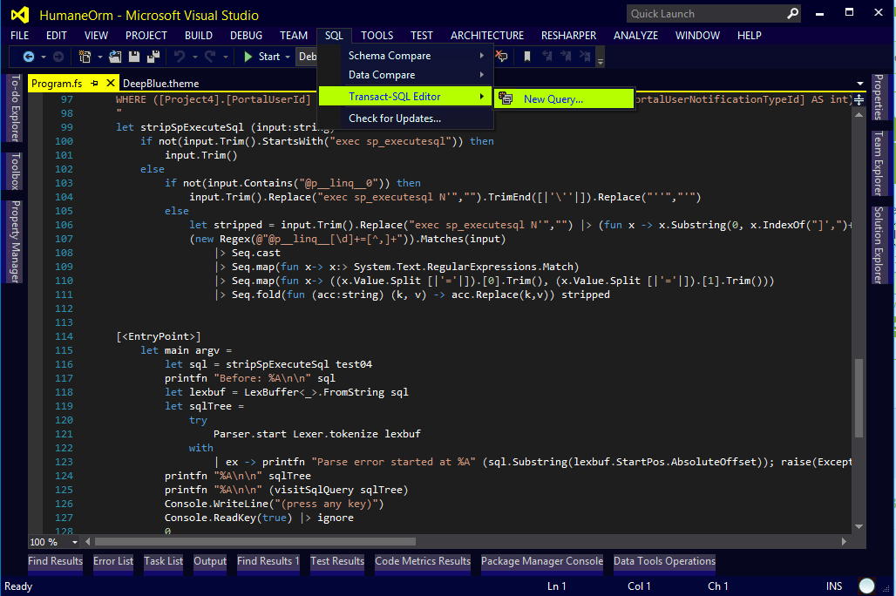
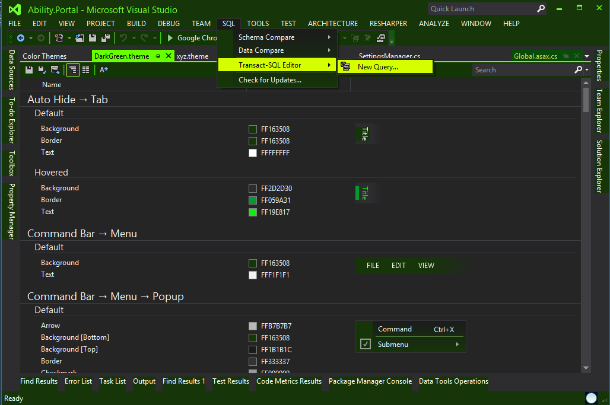
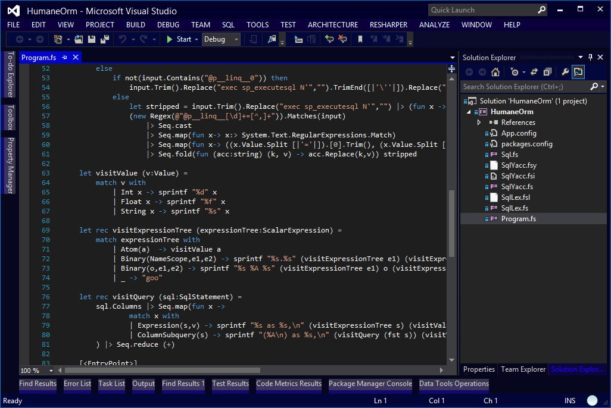
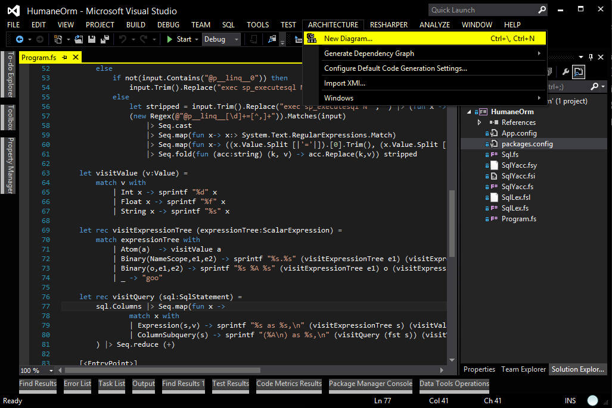
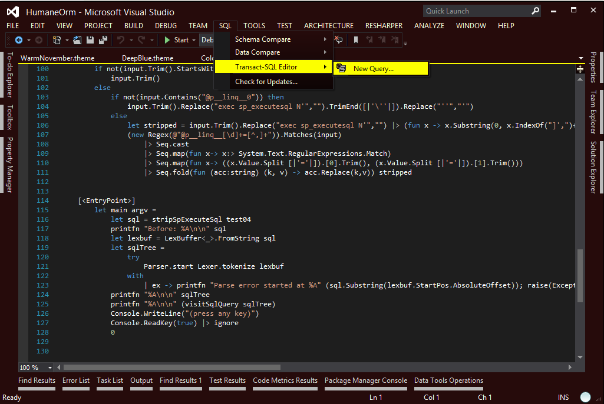
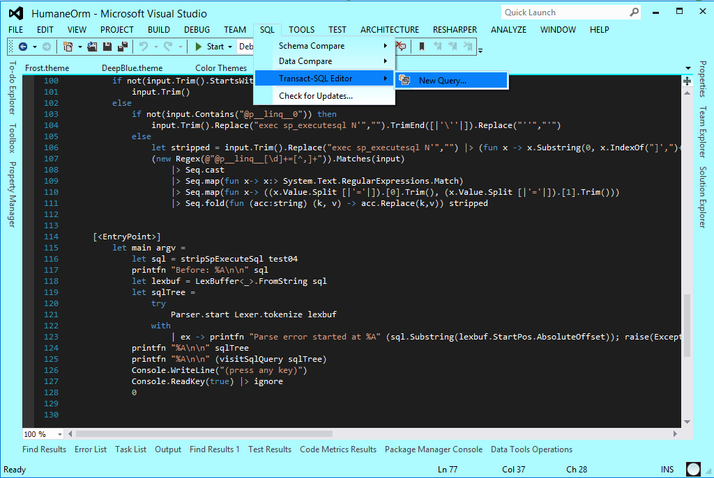

VisualStudio Themes
==================

VsTheme theme gallery for visual studio! Recommended to work with [studiostyl.es](http://studiostyl.es/)!
Use the Visual Studio Color Theme Editor extension to import!

* [Visual Studio 2012 Color Theme Editor Extension](http://visualstudiogallery.msdn.microsoft.com/366ad100-0003-4c9a-81a8-337d4e7ace05)
* [Visual Studio 2013 Color Theme Editor Extension](http://visualstudiogallery.msdn.microsoft.com/9e08e5d3-6eb4-4e73-a045-6ea2a5cbdabe)

Please fork this and add your own themes, I will accept all pull requests!

Dark Purple:

BlueYellow:

Dark Green:

Dark Blue:

Super Dark:

Warm November

Frost

